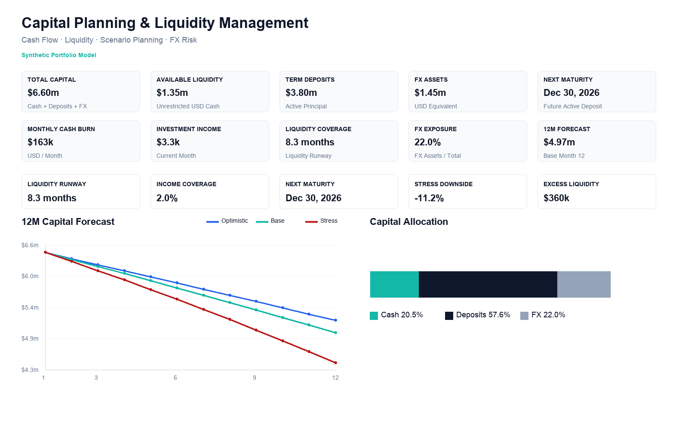
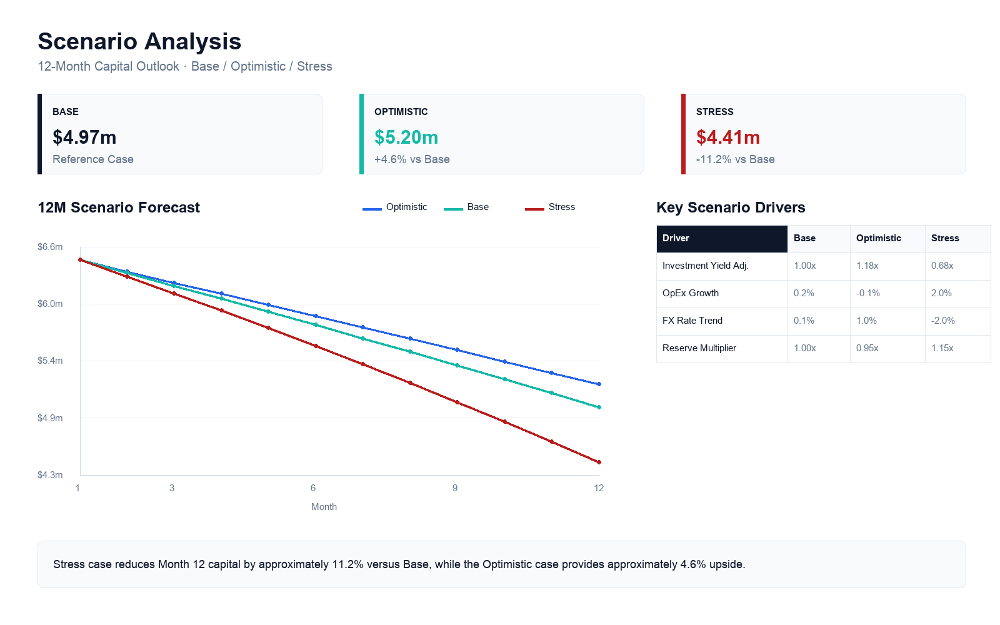
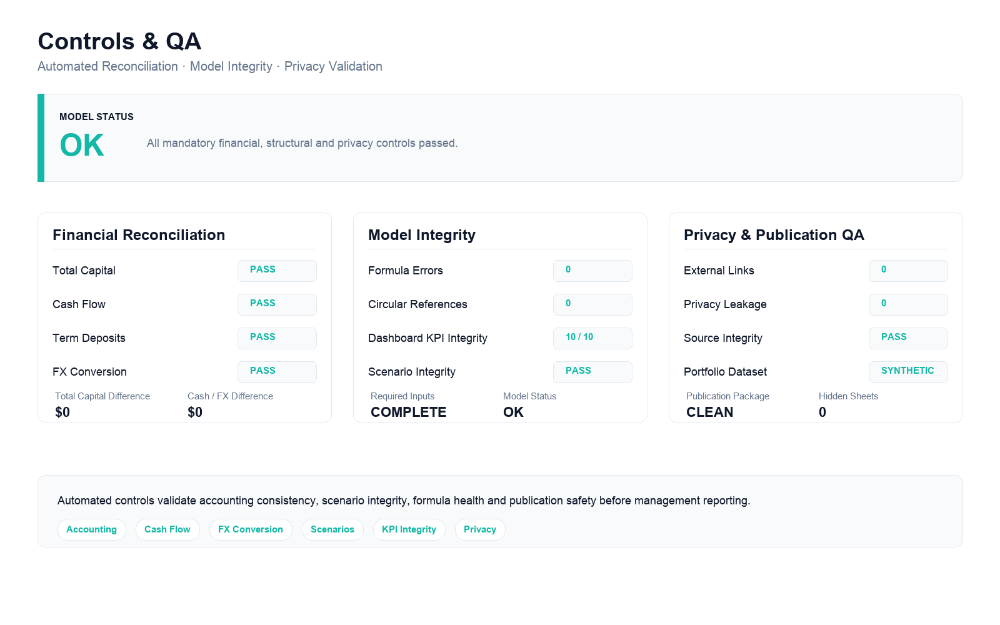

# Capital Planning & Liquidity Management Model

An Excel-based financial planning and decision-support model that consolidates liquidity, capital allocation, investment income, FX exposure, and scenario forecasting into one management system.

> All financial figures shown in this project are synthetic and created solely for portfolio demonstration.

## Executive Dashboard

The dashboard provides a management-level view of:

- total capital
- available liquidity
- term deposits
- FX assets and exposure
- monthly cash burn
- investment income
- liquidity coverage
- upcoming deposit maturities
- 12-month capital forecast

The objective is not only to report financial data, but to translate it into clear management signals and allocation decisions.

## Business Problem

Financial decisions often depend on information stored across separate cash-flow calculations, deposit schedules, FX positions, and planning assumptions.

Without a consolidated model, management may have limited visibility into:

- how much liquidity is actually available;
- whether reserves are sufficient;
- when capital becomes available from deposit maturities;
- how FX exposure affects the portfolio;
- how current decisions influence the next 12 months;
- how resilient the financial position is under different scenarios.

## Solution

I designed an integrated model that connects financial inputs with forecasting, capital-allocation logic, risk controls, and executive reporting.

The model follows a structured decision flow:

**Inputs -> Deposits -> Cash Flow -> FX Allocation -> Scenarios -> Controls -> Executive Dashboard**

This allows assumptions to flow dynamically through the model rather than relying on manually updated management reports.

## Key Capabilities

- 12-month capital forecasting
- liquidity reserve management
- term deposit maturity planning
- FX allocation and exposure monitoring
- Base / Optimistic / Stress scenario modeling
- automated financial reconciliation
- cash-flow controls
- KPI integrity checks
- management insights
- executive dashboard reporting

## Scenario Planning

The scenario engine evaluates how changes in key assumptions affect projected capital over a 12-month horizon.

Three scenarios are modeled:

- **Base** — reference operating case
- **Optimistic** — improved operating and financial assumptions
- **Stress** — adverse cost, return, FX, and reserve assumptions

The scenario layer connects assumptions directly to projected financial outcomes, making downside and upside visible before management decisions are made.

## Decision Logic

The model is designed around a simple management sequence:

**Starting Capital**  
↓  
**Investment Income & Cash Inflows**  
↓  
**Operating Expenses**  
↓  
**Minimum Liquidity Reserve**  
↓  
**Excess Liquidity**  
↓  
**Capital Allocation**  
↓  
**FX / Investment Allocation**  
↓  
**Reinvestment**  
↓  
**12-Month Capital Forecast**

This turns the workbook from a reporting file into a decision-support tool.

## Controls & QA

The model includes an automated control framework covering:

- total capital reconciliation
- cash-flow reconciliation
- deposit calculations
- FX conversion
- allocation limits
- scenario integrity
- formula errors
- circular-reference checks
- dashboard KPI integrity
- external-link detection
- privacy validation

The control layer provides a clear overall model status before financial outputs are used for management reporting.

## Model Structure

| Module | Purpose |
|---|---|
| Inputs | Centralized assumptions and planning parameters |
| Deposits | Principal, yield, maturity and reinvestment tracking |
| Cash Flow | 12-month liquidity and operating cash forecast |
| FX Allocation | FX positioning and exposure calculations |
| Scenarios | Base, Optimistic and Stress forecasting |
| Controls | Automated reconciliation and integrity checks |
| Dashboard | Executive KPIs, insights and decision support |

## Tools & Methods

**Excel** — financial model, formulas, scenarios and executive dashboard  
**Python** — model generation, reconciliation and automated QA  
**Financial Modeling** — cash flow, liquidity and capital planning  
**Automated Validation** — formula, reconciliation, scenario and privacy checks

## Skills Demonstrated

Financial Modeling · FP&A · Business Operations · Cash Flow Forecasting · Liquidity Management · Scenario Planning · Risk Controls · Management Reporting · Data Analysis · Executive Dashboard Design · Decision Support

## Data Privacy

All financial figures, institutions, assumptions and portfolio values presented in this repository are synthetic and are used solely for demonstration purposes.
